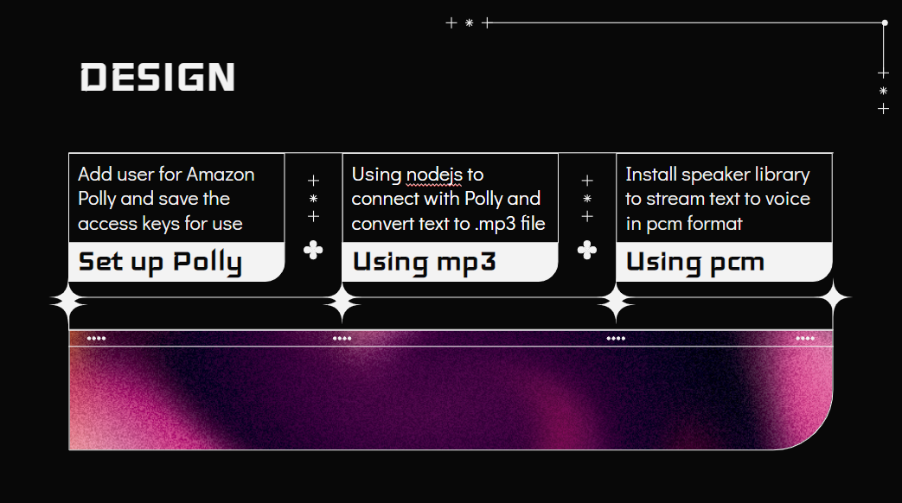
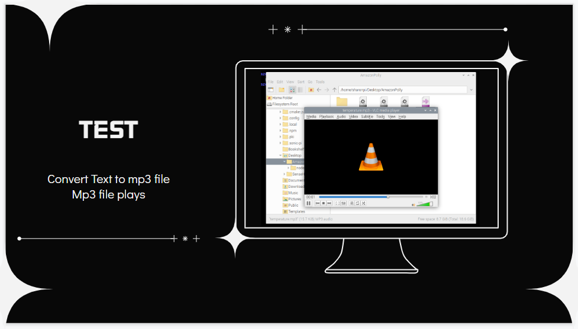
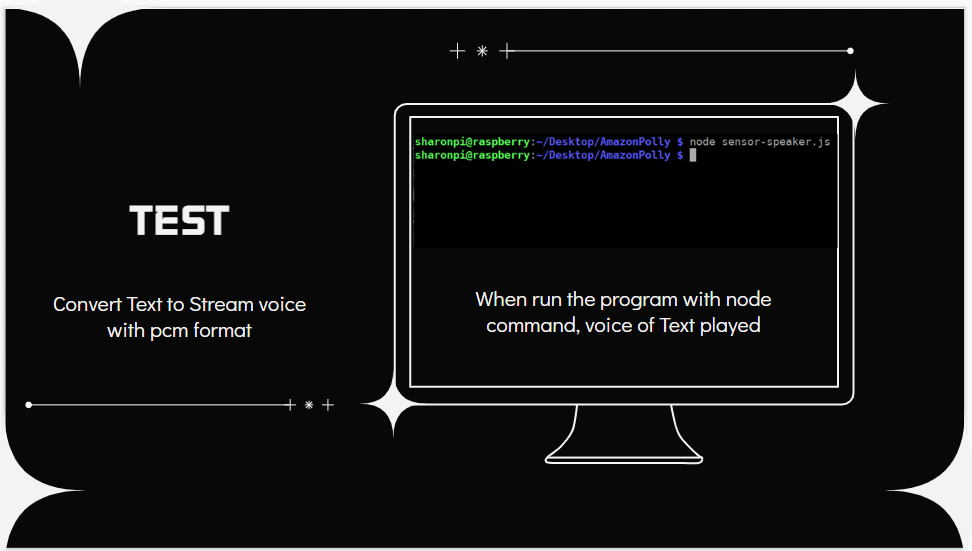

# AWS IoT + Raspberry Pi Emulator + Text to Speech

**[AWS IoT + Raspberry Pi Emulator + Text to Speech](https://docs.google.com/presentation/d/1fKxqAFuCpmXSpIH60XyMZBdL0ppaj9_DvrBLryLfuqk/edit?usp=sharing)**


## Introduction

This project is to use Amazon Polly to make the sensor speak on Raspberry Pi Desktop.


## Design





## Implementation

### To Generate mp3 file

* Create nodeis project with npm

```
$ npm init -y 
```

* Install package for nodejs in aws

```
$ npm install aws-sdk –save
```

* Program

```
const Polly = new AWS.Polly({
accessKeyId: 'xxxxx',
secretAccessKey: xxxxx',
signatureVersion: 'v4',
region: 'us-west-1'
});
 
 
const input = {
Text: "Hello, this is a test for temperature records",
OutputFormat: "mp3",
VoiceId: "Joanna",
}
```

### To stream with pcm format

* Install node-speaker package

```
$ sudo apt-get install libasound2-dev
$ npm install speaker
```

* Program

```
// Create an Polly client
const Polly = new AWS.Polly({
accessKeyId: 'xxxxxxx',
secretAccessKey: xxxxxxx',
signatureVersion: 'v4',
region: 'us-west-1'
});
 
// Create the Speaker instance
const Player = new Speaker({
  channels: 1,
  bitDepth: 16,
  sampleRate: 16000
  //channels: 2,          // 2 channels
  //bitDepth: 16,         // 16-bit samples
  //sampleRate: 44100     // 44,100 Hz sample rate
})
 
let params = {
    Text: 'Hi, this is a test for nodejs speaker',
    OutputFormat: 'pcm',
    VoiceId: 'Joanna'
}

```

## Test

* mp3



* pcm



## Enhancement
### What’s next?

After making the voice streaming work:

* Replace the hardcoded text with real-time data 
* Connect with Raspberry Pi sensor to voice streamed temperature data

More technology may be involved to achieve these goals!

## Conclusion

Successful convert text to voice with Amazon Polly in nodejs

## References
Websites:

https://docs.aws.amazon.com/AWSJavaScriptSDK/latest/AWS/Polly.html 

https://github.com/TooTallNate/node-speaker 

https://docs.aws.amazon.com/polly/latest/dg/API_SynthesizeSpeech.html 
