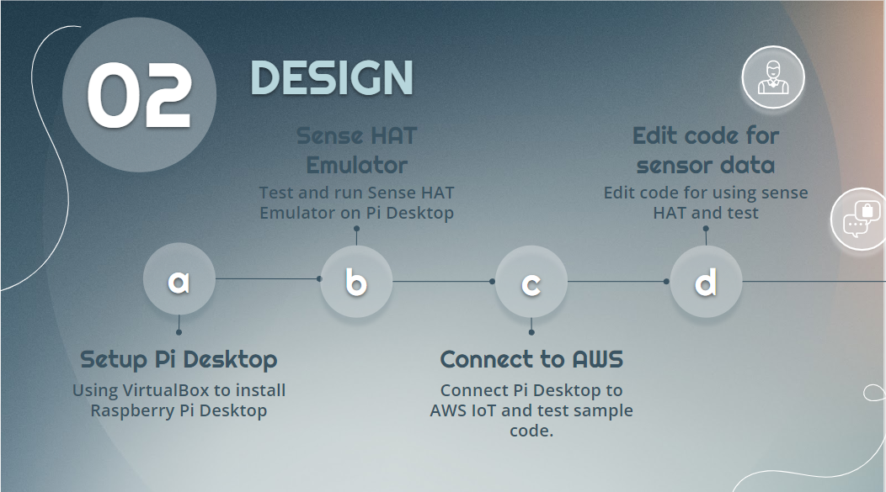
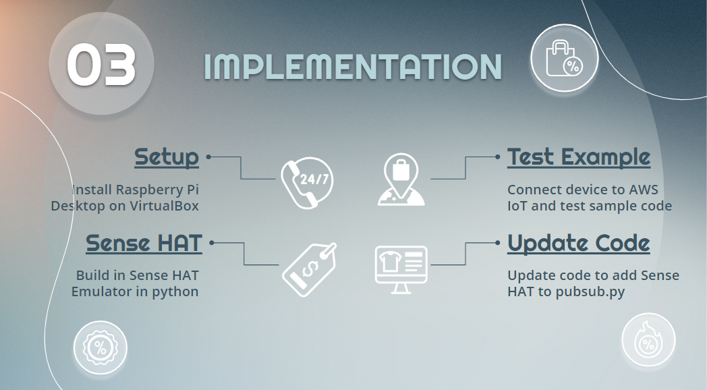
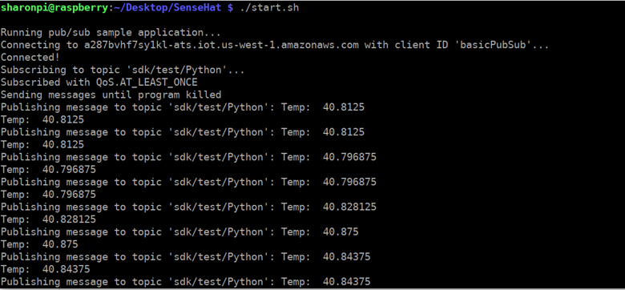
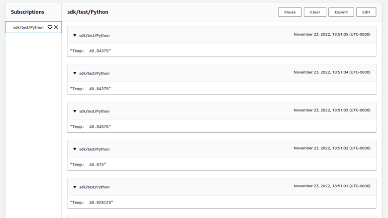

# AWS IoT + Raspberry Pi Sense HAT Emulator

**[AWS IoT + Raspberry Pi Sense HAT Emulator](https://docs.google.com/presentation/d/15I4hyDi4X2xOrow2Gl8kn8aa0b2LFHqo7L0r7cWmbB4/edit?usp=sharing)**

## Introduction

This project is to use Raspberry Pi Sense HAT Emulator to get real-time temperature data and send the data to AWS by connect the Raspberry Pi Device to AWS IoT.

## Design

Using python to send data from Raspberry Pi Sense HAT to AWS IoT.

## Implementation

## Test

* Raspberry Pi Server

* AWS IoT MQTT Test Client

## Conclusion

Connection to AWS IoT is successful and data successfully send from sense HAT emulator to AWS!
 

## References

Publish MQTT messages to AWS IoT Core using Python. (2021, October 21). AWS. Retrieved November 24, 2022, from https://aws.amazon.com/premiumsupport/knowledge-center/iot-core-publish-mqtt-messages-python/ 
